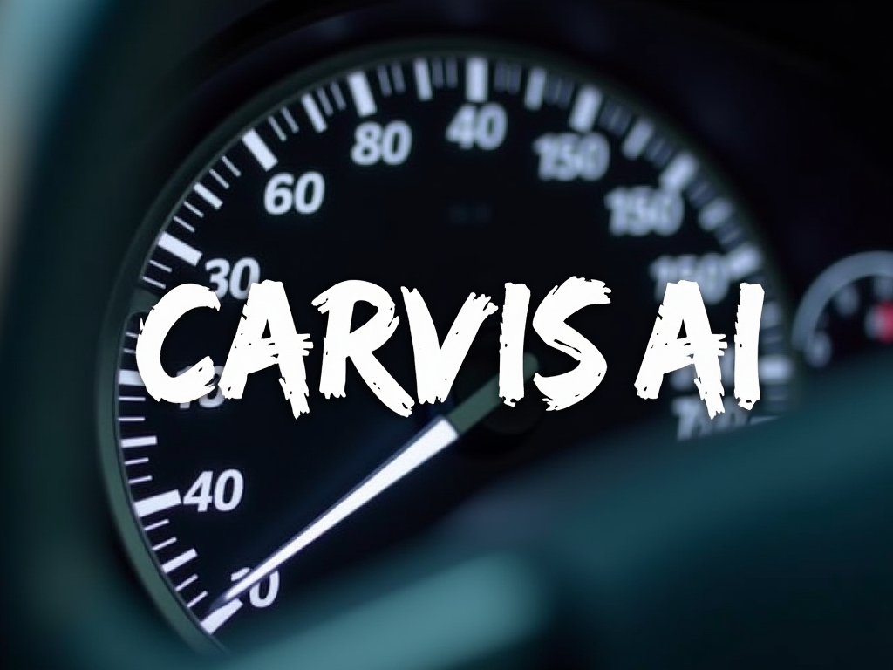

# Carvis: Your Personal Car Assistant

**Think Jarvis, but for cars - Carvis.**

Carvis is an innovative car assistant that taps into the CAN-Bus network of your vehicle, providing real-time monitoring, predictive maintenance alerts, and driving insights to enhance your driving experience and vehicle management.



## Features

### Available Now

- **Decoded CAN Frames**: JSON file with decoded data for analysis.
- **Data Analysis Notebook**: Jupyter notebook for parsing and analyzing CAN data.
- **Available Data for Analysis**:
  - ServicesDME
  - TransmissionData
  - NetworkManagment5
  - Torque2
  - SteeringButtons
  - InstrumentClusterStatus_KOMBI
  - NetworkManagment1
  - ServicesKBM
  - CruiseControlStatus
  - NetworkManagment2
  - TurnSignals
  - Time_Date
  - Speed
  - CruiseControl
  - EngineAndBrake
  - Torque_request_EGS
  - TerminalStatus
  - PowerBatteryVoltage
  - SteeringWheelAngle_slow
  - ServicesDSC
  - Range_Mileage
  - SteeringWheelAngle
  - AccPedal
  - NetworkManagment4
  - TransimissionData2
  - StatusDSC_KCAN
  - ServicesKGM
  - ServicesKOMBI
  - WheelSpeeds
  - EngineData
  - DistanceRoute
  - WheelPressure_KCAN

### Coming Soon

- **API**: An API for accessing Carvis data and integrating with other applications.

- **Predictive Maintenance**: Alerts for upcoming maintenance needs to prevent unexpected breakdowns.
- **Fuel Efficiency Monitoring**: Tips and insights to improve fuel economy.
- **Driving Behavior Analysis**: Feedback on driving habits to enhance safety and efficiency.
- **Real-time Diagnostics**: Immediate alerts for any vehicle issues detected through the CAN network.
- **Trip Logging**: Detailed logs of each trip for tracking and analysis.

## Installation

Carvis can be set up in a couple of ways depending on your preference for running it locally or using Kaggle Notebooks. Follow the steps below to get started:

### Option 1: Using Kaggle Notebooks

<a href="https://www.kaggle.com/code/fredygerman/carvis-starter-notebook?scriptVersionId=188078001" target="_blank"></a>
</br>

1. **Clone the Kaggle Notebook**: Navigate to the [Carvis Kaggle Notebook](https://www.kaggle.com/code/fredygerman/carvis-starter-analytics-kaggle). Clone the notebook to your account if you want to make changes.
2. **Run the Notebook**: Execute the cells in the notebook. By default, it uses a sample dataset.
3. **Use Your Dataset**: To analyze your own vehicle's data, upload your dataset to Kaggle and update the dataset path in the notebook accordingly.

### Option 2: Running Locally

1. **Clone the Repository**: Clone this repository to your local machine using:

   ```sh
   git clone https://github.com/Bulalu/carvis
   ```

2. **Install Dependencies**: Install the required Python packages using:

   ```sh
   pip install -r requirements.txt
   ```

3. **Run the Notebook**: Open the `analytics/starter_analytics.ipynb` notebook in Jupyter and execute the cells. You can use the sample dataset provided `decoded-frames/decoded_can_frames_june_1.json` or replace it with your own data.
